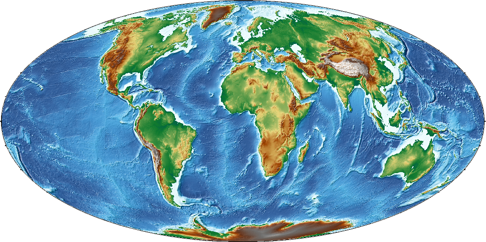

# Plotting grids and images



This part of the tutorial is dedicated to plotting gridded data in GMT: contour
plots, pseudo-color plots (images), etc.

## Topics

* [Main grid formats in GMT](#grid-formats)
* [Pixel vs grid-line registration](#grid-registration)
* [Plotting contours](#contour-plots)
* [Plotting pseudo-color images](#pseudo-color-plots)
* [Colorbars and color palette tables (CPTs)](#colorbars-and-cpts)

## Grid formats

The main file format GMT uses for grids is called **netCDF**:

> "self-describing, machine-independent data formats that support the creation,
> access, and sharing of array-oriented scientific data"
>
> https://en.wikipedia.org/wiki/NetCDF

The file contains information about:

* Data values on the grid
* Coordinates
* Metadata: units, projections, etc

All stored in a [binary file](https://en.wikipedia.org/wiki/Binary_file) that
support data compression and is widely accessible from other software (GIS,
Matlab, Python, etc).

Further reading: https://docs.generic-mapping-tools.org/latest/gmt.html#grd-inout-full

### Follow along

> Open a terminal and follow along with the exercise.

All GMT commands that operate on grids start with `grd`: `grdimage`,
`grdsample`, `grdcontour`, etc.

Use [`grdinfo`](https://docs.generic-mapping-tools.org/latest/grdinfo.html) to
get information about a grid file:

```
gmt grdinfo @earth_relief_10m
```

The option `-Cn` will print only numerical information about the grid (
`w e s n z0 z1 dx dy nx ny` by default):

```
gmt grdinfo @earth_relief_10m -Cn
```

Further reading: https://docs.generic-mapping-tools.org/latest/grdinfo.html

**BONUS**

Option `-o` can be combined with `-Cn` to select only one of the number printed
out. This is useful if you need to use this information as input for other
commands or assign them into *variables*. For example, we can get the grid
spacing in the x dimension:

```
gmt grdinfo @earth_relief_10m -Cn -o6
# Or store it in a variable with
dx=`gmt grdinfo @earth_relief_10m -Cn -o6`
```

## Grid registration

The coordinates of grids and what the data values represent can be specified in
two ways (known as the grid *registration*):

* **Grid lines:** the coordinates correspond to the center of the area that is
  represented by the data value (where grid lines intersect)
* **Pixels:** the coordinates correspond to the borders of the area (pixel)


*Gridline (left) and pixel (right) registration of data nodes. The red shade
indicates the areas represented by the value at the node (solid circle).*

Grids are generated using one of the two options and it's **very important to
know which you have** (hint: `grdinfo` can tell you). The plotting modules in
GMT can usually automatically detect this. When generating output grids, you
can specify which one you want using the `-r` option.

Further reading: https://docs.generic-mapping-tools.org/latest/cookbook/options.html#grid-registration-the-r-option

### Follow along

Let's use `grdinfo` to figure out if the Earth relief grids are gridline or
pixel registered:

```
gmt grdinfo @earth_relief_10m
```

GMT actually distributes both versions of the Earth relief data. You can
specify which version you want by appending `_p` (for pixel) or `_g` (for
gridline) to the file name (for example, `@earth_relief_10m_p`).

Further reading: https://docs.generic-mapping-tools.org/latest/datasets/remote-data.html#global-earth-relief-grids

## Contour plots

### Follow along

> Open VSCode (or your text editor of choice) and follow along with the
> exercise.


## Pseudo-color plots

### Follow along

## Colorbars and CPTs

### Follow along

## Exercise

You will be split into teams to work on an exercise:

1. Discuss with your team which commands and options you would use
2. Work together to make a script that generates the desired plot
3. If you have any questions, ask on the Slack chatroom

**Bonus:** If you're all finished with the exercise and want an extra challenge,
try the following:
