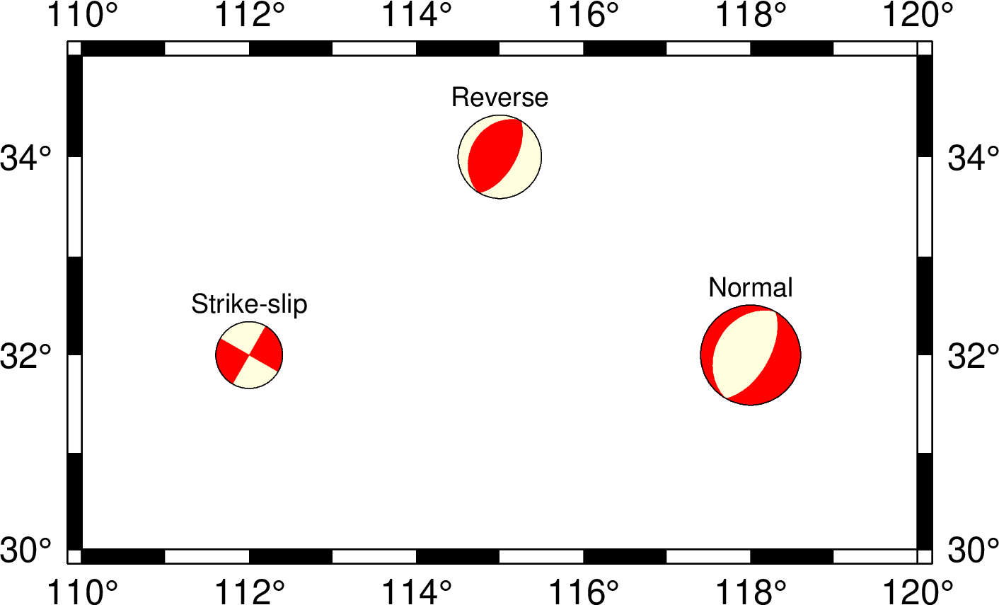

# Seismology: Plotting beachballs

The goal of this session is to show how to plot beachballs on maps and cross-sections.

Map view (**meca**)        |  Cross-section view (**coupe**)
:-------------------------:|:-------------------------:
  |  

**Instructor:**
[Dongdong Tian](https://msu.edu/~tiandong/)

**Resources**

- Focal Mechanisms Explained: What are those “beach balls”? https://www.youtube.com/watch?v=MomVOkyDdLo (~ 6 minutes)
- manpage of [meca](https://docs.generic-mapping-tools.org/6.1/supplements/seis/meca.html)
- manpage of [coupe](https://docs.generic-mapping-tools.org/6.1/supplements/seis/coupe.html)
- [Global CMT project](https://www.globalcmt.org/)

**Contents**

- [Explain Focal Mechanism]()
- [Plot beachballs on maps]()
- [Plot beachballs on cross-sections]()
- [Get focal mechanism solutions from Global CMT]()
- [Group Exercise]()

## Focal mechanism and beachball

Focal mechanism describes the movement of the fault that generates the
seismic waves. From focal mechanism solutions, we can know the orientation of the fault plane and the direction it slips.


Beachball is a graphic represention of focal mechanism. Usually compressional parts are painted black, and extensional parts are painted by white.

Here are three simple focal mechanism solutions for normal fault, reverse fault, and strike-slip fault.


We will use these three focal mechanisms as the example data.
```
# longitude latitude depth strike dip rake magnitude
112 32 25  30  90   0  4  Strike-slip
115 34 15  30  60  90  5  Normal
118 32 45  30  60 -90  6  Reverse
```

First, we need to copy/paste the data and save it into a plaintext file.

## Plot beachballs on maps

The [meca](https://docs.generic-mapping-tools.org/6.1/supplements/seis/meca.html) module
can plot beachballs on maps.

**-S** is the most important option of **meca**, it determines the input data format,
beachball size, and other properties of optional title string.

Other useful options:

- **-M**: same size for all beachballs
- **-E**: color for extensive quadrants
- **-G**: color for compressional quadrants
- **-Z**: paint the compressional quadrants based on depth (you need to create a CPT via calling `makecpt` module first)

**A simple plot**


**Different colors**



**Color by depth**


## Plot beachballs on cross-sections

`coupe` module can cut and plot beachballs in cross-sections (e.g., a vertical cross-section).

Two most important options:

- **-S**: the same as **meca**
- **-A**: determine the cross-section

There are different ways to specify the geometry of a cross-section. Here we will
use **-Aa** as an example. The full syntax of the **-A** option is:

```
-Aalon1/lat1/lon2/lat2/dip/p_width/dmin/dmax[+f]
```

- lon1/lat1: location of the starting point
- lon2/lat2: location of the end point
- dip: dip angle of the cross-section: 0 for horizontal slice, 90 for vertical slice
- p_width: width of the cross-section
- dmin/dmax: depth range of the cross-section
- **+f**: automatically determine the plot region!

**Cross-section view**


## Get focal mechanism solutions from Global CMT

Global CMT: https://www.globalcmt.org/

The GCMT project provides focal mechasnism solutions for global earthquakes with M>5.5 since 1976.

1. Go to the [GCMT official site](https://www.globalcmt.org/), and click the
   [CMT catalog web search](https://www.globalcmt.org/CMTsearch.html) link.

2. Enter the parameters to select earthquakes:

   - start time and end time
   - magnitude range
   - location
   - etc

3. Select "Output type": "**GMT psmeca input**" (NOT "GMT psvelomeca input")

4. Click the "Done" button
5. Copy/paste the solutions into a plaintext file and save it.
6. Now you can plot the beachballs using **meca** or **coupe**

**NOTE**: Use **-Sd** for GCMT solutions, NOT **-Sa**.

## Group Exercise

You will be split into teams to work on an exercise:

- Discuss with your team which commands and options you would use
- Work together to make a script that generates the desired plot
- If you have any questions, ask on the Slack chatroom

**Make a regional map with beachballs colored by depth**

- Select the region you want to work on
- Go to [GCMT web search site](https://www.globalcmt.org/CMTsearch.html),
  select the focal mechanism solutions by specifying geographic range, time range,
  and magnitude range. Save the solutions to a file.
- Make a map view of beachballs with colors determined by depth
- Based on a the map view plot, choose a cross-section, and make a cross-section view

**TIPS**

- You need to use **-Sd** for GCMT solutions
- Use **-i0-9** to read the first 10 columns, so that **meca** and **coupe** won't
  plot the event title strings

Map view (**meca**)        |  Cross-section view (**coupe**)
:-------------------------:|:-------------------------:
  |  

**SOLUTION**

Don't look at the solutions until you finish you own script.

The examples above are plotted using data [`japan-focal.dat`](japan-focal.dat)
using script [`japan-beachballs.sh`](japan-beachballs.sh).